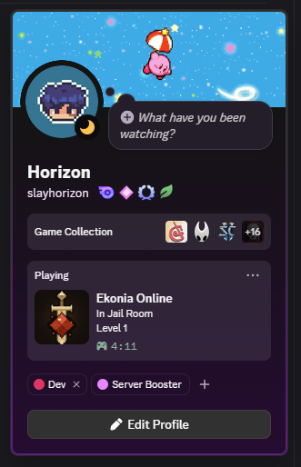
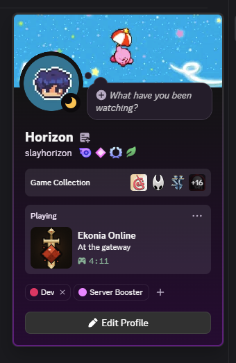

# Discord Rich Presence for Godot

Discord Rich Presence for Godot 4.4+ in pure GDScript. No GDExtension, no
DLLs, no Game SDK.

One little script. Works on Windows, macOS and Linux.

<p align="center">
  
  &nbsp;&nbsp;
  
</p>

I made this for my game [Ekonia Online](https://ekoniaonline.com) because I
ship a single binary file, and every existing Godot addon for Rich Presence
wraps the Discord Game SDK: several MB of native libraries to put next to
your game executable, for a feature that is in fact some JSON on a local
pipe. Also, Discord deprecated most of the Game SDK.

## Quick start

1. Copy `addons/discord_rich_presence/` into your project. Nothing to enable,
   it is a plain script class.
2. Create an application on the
   [Discord Developer Portal](https://discord.com/developers/applications)
   and copy its Application ID.
3. Use it:

```gdscript
var presence := DiscordRichPresence.new()
presence.app_id = "1234567890123456789"
add_child(presence)  # An autoload is the perfect parent: the connection lives as long as the node.

presence.set_activity({
    "details": "In the Fungus Cave",
    "state": "Level 12",
    "timestamps": {"start": int(Time.get_unix_time_from_system())},
    "assets": {"large_image": "your_art_asset_key"},
})
```

(Image keys come from your application page, under Rich Presence > Art
Assets.)

Dead simple as that. The node connects when it can, retries every 20s while
Discord is closed, and sends the last activity again after a reconnect.
Discord being absent is never an error.

## Under the hood

<details>
<summary>The protocol, for the curious. You do not need this to use the addon.</summary>

The Discord desktop client listens on a local IPC channel: a named pipe on
Windows, a unix socket on macOS and Linux. The protocol is simple:

- one frame = `[opcode u32 LE][length u32 LE][JSON body]`
- op 0: handshake `{"v": 1, "client_id": "<app id>"}`, Discord answers READY
- op 1: `SET_ACTIVITY` when your presence changes
- op 3/4: ping/pong, op 2: close

On Windows, Godot opens the pipe directly with `FileAccess`. GDScript
cannot open unix sockets, so on macOS and Linux the addon spawns the
system netcat (`nc -U`) with `OS.execute_with_pipe()` and talks to the
socket through it. Still no shipped binary: netcat is part of the OS.

</details>

## Godot pitfalls to know

<details>
<summary>I hit all of these while writing this. They are handled by the
addon, but if you write your own client they will save you a day.</summary>

1. Godot only opens Windows named pipes with the `\\?\pipe\name` path
   form. The usual `\\.\pipe\name` form fails with `ERR_FILE_NOT_FOUND`.
2. `FileAccess` reads are buffered. The first `get_32()` reads everything
   the pipe holds into an internal buffer, and `get_length()` only sees the
   OS pipe. So read a frame's header and body in the same pass: a second
   `get_length()` check after the header will report 0 while your bytes
   are in the buffer.
3. `OS.execute_with_pipe()` gives blocking pipes by default: the first
   read with no data freezes your game. Pass `blocking = false`, which
   exists since Godot 4.4. This is why the addon needs 4.4 outside
   Windows.
4. `FileAccess.file_exists()` returns false for a unix socket. To find
   one, list its directory with `DirAccess.get_files_at()` instead.

</details>

## Platform support

| Platform | Presence |
|---|---|
| Windows | yes |
| macOS / Linux | yes, bridged through the system `nc` |
| Web / Android / iOS | does nothing: Discord has no RPC on these platforms |
| Headless (servers, CI) | does nothing, by design |

You do not need any platform check on your side.

On Godot 4.3, use
[v1.0](https://github.com/SlayHorizon/discord-rich-presence-godot/tree/v1.0):
Windows only.

## API

- `app_id: String`: your Discord application id. Set it before add_child,
  or call `connect_now()` after changing it.
- `set_activity(activity: Dictionary)`: the SET_ACTIVITY activity object
  (details, state, timestamps, assets, party, ...). The dictionary goes to
  Discord as-is, so buttons and every future field work without addon
  changes. Remembered across reconnects, safe to call while Discord is
  closed. Call it when something changes, not every frame: Discord rate
  limits presence updates.
- `clear_activity()`: remove the presence, keep the connection.
- signal `presence_connected(user: Dictionary)`: handshake done, `user` is
  the Discord user object.
- signal `presence_disconnected`: connection dropped, the client retries
  alone.

## License

Source code under the [MIT License](LICENSE). The Godot logo in the icon
is by Andrea Calabró, [CC-BY 4.0](https://creativecommons.org/licenses/by/4.0/).
